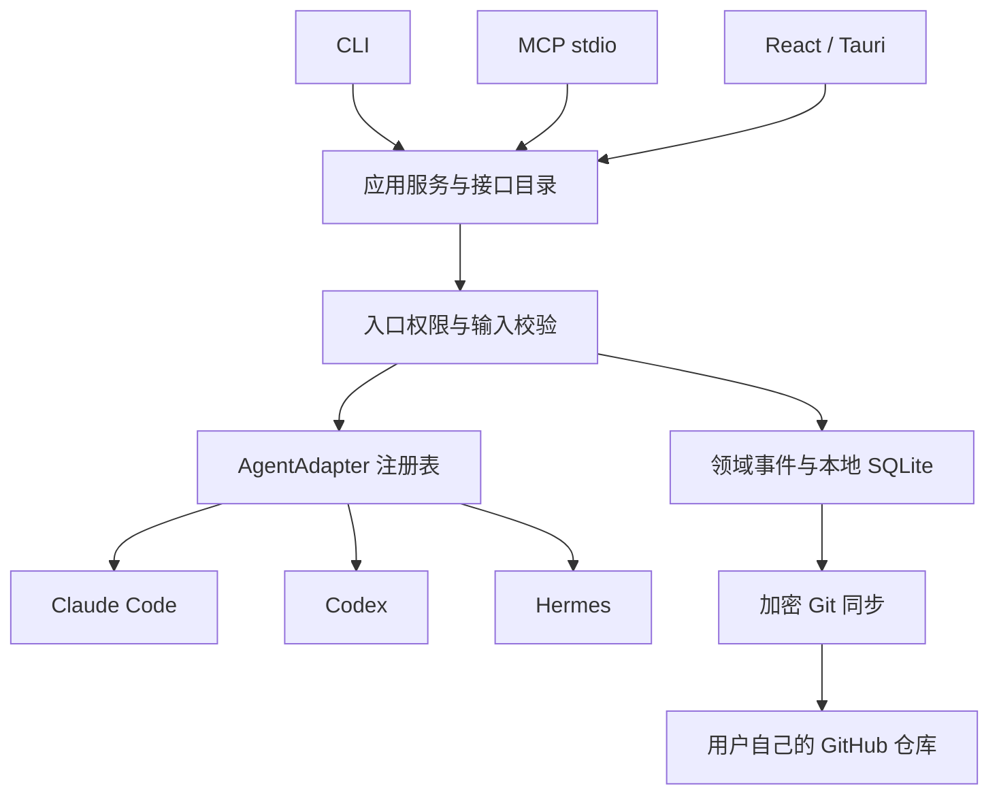

# 架构

`Service::call` 是共同业务入口。`operations()` 保存方法名称、JSON 输入 schema、读写/网络/管理标记和 MCP 工具名称。所有入口复用它，不重复实现业务规则。输出统一为 `{api_version, ok, data|error}`，错误具有稳定的 `code`，必要时包含结构化 `details`。

本地记录由不可变事件构成。一个事件引用之前的父版本；没有被后继事件引用的版本为当前 head。一个实体有多个 head 时存在冲突。`update` 要求调用者提供唯一当前版本，`resolve` 要求提供全部当前版本。SQLite 事务将新事件一次提交，派生视图可以从事件重建。

设备 UUID 是事件来源标识，不是身份认证。事件时间用于显示，不参与冲突胜负。当前只有一个本地 vault，尚无多租户或细粒度资源授权。

`AgentAdapter` 有三个基础接口：

- `descriptor()`：稳定标识、可调用能力、实际实现的限制。
- `prepare_launch()`：返回 executable、argv、cwd、env 和告警，不执行 shell 拼接。
- `mcp_registration()`：返回目标格式与注册文档数据，不自行改写配置。

添加新 agent 的步骤：实现 trait、登记适配器、增加契约样例并验证目标运行时版本。协议入口和领域存储不应因此改变。未来加入 `probe / inspect / plan_apply / apply / rollback / discover_sessions` 等明确接口时，先定义共同 DTO 和错误，再由适配器实现，不能以一个“支持 agent”布尔值代替细粒度能力。

运行时接口的 agent 参数枚举来自服务的注册表，未安装的适配器不能被调用。会话记录保留 agent 标识作为可迁移元数据，不要求每台设备都支持该运行时，也不会因此执行外部程序。默认注册表严格只有 Claude Code、Codex、Hermes。

当前 Claude Code 身份材料使用 append-system-prompt 参数；Codex 使用 developer_instructions 覆盖；Hermes 使用初始用户消息。它们的语义有差异，描述中明确声明。当前计划基于官方文档和本机 CLI/source 核对，未执行真实会话。原生恢复也只准备本机参数，不说明远端状态已迁移。

Tauri 桥接在 blocking worker 上调用服务。桌面、CLI 与 MCP 默认使用同一个数据目录，也可以显式指定。不存在公共 HTTP API 或 Continuo 同步服务。

同步当前通过 `SyncBackend` 的实验性 Git 实现。新增第二种存储前，需将读取远端快照、发布事件和条件提交细化为传输契约，保持加密、因果合并和冲突处理在共同引擎中。
